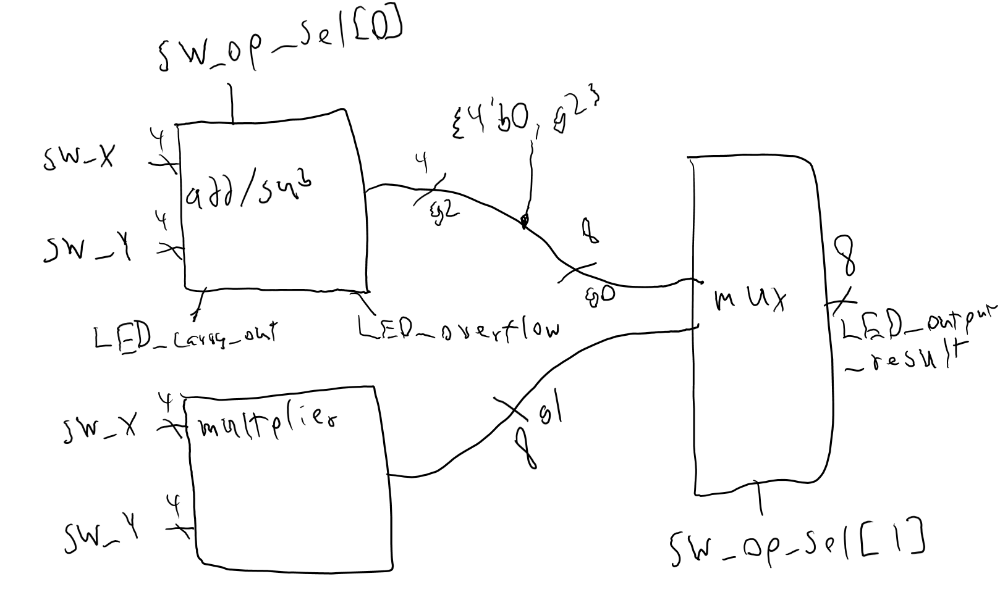
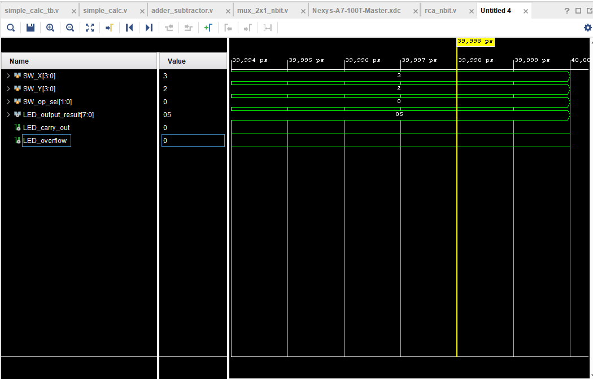

# ECE_3300L_LAB1

This assignment is the Verilog from group member Matthew Tootoonchi in group 8. Part 1 of the lab is not complete yet since my partner withdrawn from the course and there isn't enough time for me to catch up for him however, part 2 is fine except for the multiplier not in place since is part 1's assignment. 

Block diagram

Testbench 1

Here are the YouTube links for the demonstration of how the code functions.
Part 1: N/A

Part 2:
