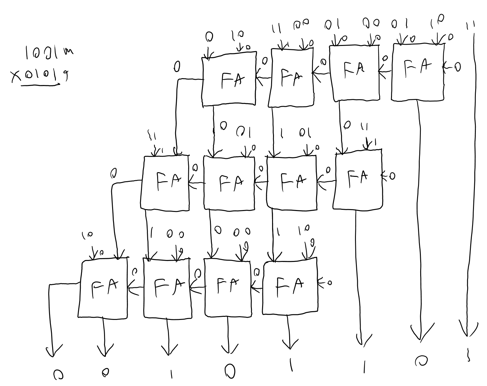

# ECE_3300L_LAB1

This assignment is the Verilog from group member Matthew Tootoonchi in group 8. Evidence of a damaged FPGA is also posted here.

Here are the YouTube links for the demonstration of how the code functions.

FPGA Broken?: 
https://youtu.be/XBpQ3r_-nuM

Working Calculator:
https://youtu.be/7mggknlUh9M

Archive:
https://youtu.be/T-GjDDVwlOg

ALso, Here are the pictures.

Block diagram

Multiplier

9x5

14x11

Testbench 1

Testbench 2

Testbench 3

Testbench 4

Testbench 5

